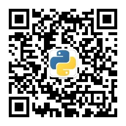

# ant-learn-pandas
pandas学习课程代码仓库


***视频全集地址：https://github.com/peiss/ant-learn-pandas***

***如果购买了视频套餐，加我微信ant_learn_python，必定答疑！！！***


***公众号名字：蚂蚁学Python***

欢迎大家关注我的微信公众号，分享很多Python领域学习的视频  
关注：Python基础入门，爬虫、数据分析、大数据处理、机器学习、推荐系统等领域  


### 注意，我使用的版本列表：
```
pandas==1.0.1
numpy==1.18.1
Flask==1.1.1
PyMySQL==0.9.3
pyecharts==1.7.1
requests==2.22.0
seaborn==0.10.0
SQLAlchemy==1.3.13
tensorboard==2.1.1
tensorflow==2.1.0
```

大家可以用pip install -r requirements.txt安装一样的环境
